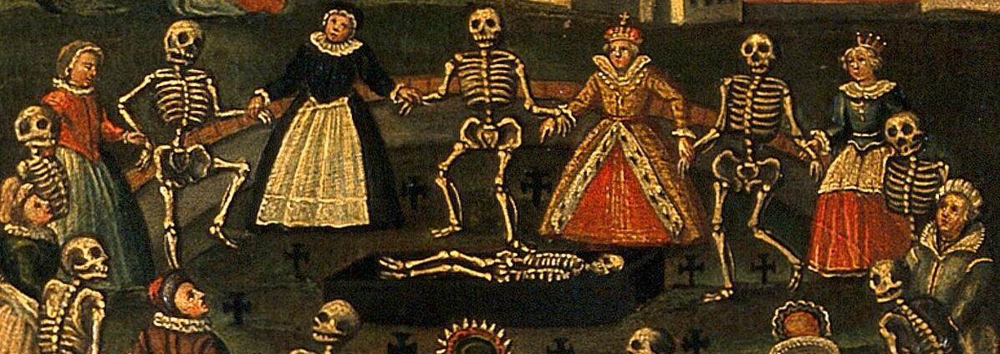

<h1 align="center">
  Frances Grace Hart
</h1>

Hello! My name is Grace Hart (she/her) and I am an undergraduate psychology student at Boston College graduating in December 2023. I hope to pursue a PhD in clinical psychology, where I would like to use computational modeling to improve our understanding of the relationship between suicide, death attitudes, and eudaemonic wellbeing. I am currently completing an Honors Thesis in the Cognition and Affect Research and Education Lab at McLean Hospital, and recently began as an intern in the Belief, Learning, and Memory Lab at Yale School of Medicine. In my free time, I enjoy reading and practicing yoga.

  

